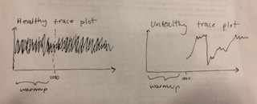

```{r setup, include=FALSE}
knitr::opts_chunk$set(echo = TRUE)
```

## Chapter 8 Homework  

###Easy Problems  

####8E1
The requirement of the simple Metropolis algorithm is:  
(3) The proposal distribution must be symmetric.  

####8E2  
Gibbs sampling achieves greater efficiency than the Metropolis algorithm because it uses adaptive proposals. In other words, it intelligently updates the proposed posterior distribution by using conjugate pairs of elements from the prior distributions and likelihoods. These pairs each have a solutions for the structure of the posterior distribution that guide the algorithm as it moves through the posterior distributions.  

####8E3  
The Hamiltonian Monte Carlo cannot handle discrete parameters, because discrete parameters would require distinct steps rather than moving continuously according to rates.  

####8E4  
The actual number of samples is the number of complete cases in your data set. The effective number of samples is the number of independent samples, meaning that they are not autocorrelated with other samples in the Markov chain.   

####8E5  
Rhat should approach 1.00 when a chain is sampling the posterior distribution correctly.  

####8E6  
A healthy trace plot of a chain has two elements. First, they exhibit stationarity, meaning that the traces fall around a central value inside of the posterior distribution. Second, they show good mixing, in that the start value of a trace is not correlated with the one that came previously, providing the zig-zag shape seen in the sketch below on the left.  

An unhealthy trace plot can be identified by the wandering nature of the trace. It is not centered around the mean value but instead jumps from high to low and back to high values. Additionally, it seems as though the successive samples are correlated with previous ones, such that the trace gets "stuck" and doesn't show random mixing. Both of these elements are illustrated in the sketch on the right side of the image below. 



###Medium Problems  

####8M1  
```{r, message=FALSE, warning=FALSE}
library(brms)
library(rethinking)
library(tidyverse)
library(knitr)

data("rugged")
d <- rugged
dd <- d %>% mutate(log_gdp = log(rgdppc_2000)) %>% filter(!is.na(log_gdp))

suppressMessages(h8.0 <- brm(data = dd, family = gaussian,
      log_gdp ~ 1 + rugged + cont_africa + rugged:cont_africa,
      prior = c(prior(normal(0, 100), class = Intercept),
                prior(normal(0, 10), class = b),
                prior(cauchy(0, 2), class = sigma))))

h8.1 <-
  brm(data = dd, family = gaussian,
      log_gdp ~ 1 + rugged + cont_africa + rugged:cont_africa,
      prior = c(prior(normal(0, 100), class = Intercept),
                prior(normal(0, 10), class = b),
                prior(uniform(0, 10), class = sigma)))

h8.2 <-
  brm(data = dd, family = gaussian,
      log_gdp ~ 1 + rugged + cont_africa + rugged:cont_africa,
      prior = c(prior(normal(0, 100), class = Intercept),
                prior(normal(0, 10), class = b),
                prior(exponential(1), class = sigma)))

print(h8.0)
print(h8.1)
print(h8.2)
```

In this case, the different priors do not have any detectible influence on the posterior. For all three models, h8.0 (cauchy prior), h8.1 (uniform prior), and h8.2 (exponential prior) have almost exactly the same estimates for the parameters. The differences between parameters are all around +/- 0.1, which does not change the interpretation of the model. Similarly, there does not seem to be much of a difference between the number of effective samples in each model. This is could either be because the priors are weak or because there is enough data to overwhelm the priors. 

###8M2
```{r, message=FALSE, warning=FALSE}

h8.3 <-
  brm(data = dd, family = gaussian,
      log_gdp ~ 1 + rugged + cont_africa + rugged:cont_africa,
      prior = c(prior(normal(0, 100), class = Intercept),
                prior(normal(0, 10), class = b),
                prior(cauchy(0, 1), class = sigma)))

h8.4 <-
  brm(data = dd, family = gaussian,
      log_gdp ~ 1 + rugged + cont_africa + rugged:cont_africa,
      prior = c(prior(normal(0, 100), class = Intercept),
                prior(normal(0, 10), class = b),
                prior(cauchy(0, 0.1), class = sigma)))

h8.5 <-
  brm(data = dd, family = gaussian,
      log_gdp ~ 1 + rugged + cont_africa + rugged:cont_africa,
      prior = c(prior(normal(0, 100), class = Intercept),
                prior(normal(0, 10), class = b),
                prior(cauchy(0, 0.01), class = sigma)))

h8.6 <-
  brm(data = dd, family = gaussian,
      log_gdp ~ 1 + rugged + cont_africa + rugged:cont_africa,
      prior = c(prior(normal(0, 100), class = Intercept),
                prior(normal(0, 10), class = b),
                prior(exponential(1), class = sigma)))

h8.7 <-
  brm(data = dd, family = gaussian,
      log_gdp ~ 1 + rugged + cont_africa + rugged:cont_africa,
      prior = c(prior(normal(0, 100), class = Intercept),
                prior(normal(0, 10), class = b),
                prior(exponential(0.1), class = sigma)))

h8.8 <-
  brm(data = dd, family = gaussian,
      log_gdp ~ 1 + rugged + cont_africa + rugged:cont_africa,
      prior = c(prior(normal(0, 100), class = Intercept),
                prior(normal(0, 10), class = b),
                prior(exponential(0.01), class = sigma)))

print(h8.3)
print(h8.4)
print(h8.5)

print(h8.6)
print(h8.7)
print(h8.8)

post_c1 <- posterior_samples(h8.3)
post_c2 <- posterior_samples(h8.4)
post_c3 <- posterior_samples(h8.5)

post_c <- cbind(post_c1$sigma, post_c2$sigma, post_c3$sigma)
colnames(post_c) <- c("Weak", "Medium", "Strong")
post_c <- as.data.frame(post_c)
post_c <- gather(post_c, key = prior, value = sigma, Weak:Strong)
post_c$prior <- as.factor(post_c$prior)

c <- ggplot(data = post_c, 
      aes(x = sigma, color = prior)) +
      geom_density() +
      xlab(expression(sigma)) + 
      ggtitle("Effect of Prior on Posterior Distribution, Cauchy")

post_e1 <- posterior_samples(h8.6)
post_e2 <- posterior_samples(h8.7)
post_e3 <- posterior_samples(h8.8)

post_e <- cbind(post_e1$sigma, post_e2$sigma, post_e3$sigma)
colnames(post_e) <- c("Weak", "Medium", "Strong")
post_e <- as.data.frame(post_e)
post_e <- gather(post_e, key = prior, value = sigma, Weak:Strong)
post_e$prior <- as.factor(post_e$prior)

e <- ggplot(data = post_e, 
      aes(x = sigma, color = prior)) +
      geom_density() +
      xlab(expression(sigma)) + 
      ggtitle("Effect of Prior on Posterior Distribution, Exponential")

c
e

```

These two plots show the posterior distribution of sigma for the models with weak, medium, and strong priors that are either specified to be of the cauchy functional form or the exponential functional form. Interestingly, neither plot shows much difference in the shape or precision of the posterior distribution across prior strengths. The strongest prior density line on the plot with the information from the models estimated with the cauchy prior does show slightly more precision and a higher peak than the weak or medium priors, but not by much. Similarly, the output shows that the estimates are all about the same across the priors. The plot with the posterior samples drawn from models estimated using the exponential prior are even more similar, such that there are very few differences between the density lines for the priors of different strengths. 

The reason for this similarity across prior strengths is likely because there is enough data to overwhelm the prior, meaning that the specification of the prior has very little effect on the final estimates produced by the model. 

#8M3
```{r, message=FALSE, warning=FALSE}
h8.9 <-
  brm(data = dd, family = gaussian,
      log_gdp ~ 1 + rugged + cont_africa + rugged:cont_africa,
      prior = c(prior(normal(0, 100), class = Intercept),
                prior(normal(0, 10), class = b),
                prior(cauchy(0, 1), class = sigma)),
      iter = 2000, warmup = 25)

h8.10 <-
  brm(data = dd, family = gaussian,
      log_gdp ~ 1 + rugged + cont_africa + rugged:cont_africa,
      prior = c(prior(normal(0, 100), class = Intercept),
                prior(normal(0, 10), class = b),
                prior(cauchy(0, 1), class = sigma)),
      iter = 2000, warmup = 50)

h8.11 <-
  brm(data = dd, family = gaussian,
      log_gdp ~ 1 + rugged + cont_africa + rugged:cont_africa,
      prior = c(prior(normal(0, 100), class = Intercept),
                prior(normal(0, 10), class = b),
                prior(cauchy(0, 1), class = sigma)),
      iter = 2000, warmup = 100)

h8.11a <-   brm(data = dd, family = gaussian,
      log_gdp ~ 1 + rugged + cont_africa + rugged:cont_africa,
      prior = c(prior(normal(0, 100), class = Intercept),
                prior(normal(0, 10), class = b),
                prior(cauchy(0, 1), class = sigma)),
      iter = 2000, warmup = 250)

h8.11b <-
  brm(data = dd, family = gaussian,
      log_gdp ~ 1 + rugged + cont_africa + rugged:cont_africa,
      prior = c(prior(normal(0, 100), class = Intercept),
                prior(normal(0, 10), class = b),
                prior(cauchy(0, 1), class = sigma)),
      iter = 2000, warmup = 500)

h8.11c <-
  brm(data = dd, family = gaussian,
      log_gdp ~ 1 + rugged + cont_africa + rugged:cont_africa,
      prior = c(prior(normal(0, 100), class = Intercept),
                prior(normal(0, 10), class = b),
                prior(cauchy(0, 1), class = sigma)),
      iter = 2000, warmup = 1000)

print(h8.9)
print(h8.10)
print(h8.11)
print(h8.11a)
print(h8.11b)
print(h8.11c)
```

Estimating the terrain model at different levels of warmup (from 25 to 1000 across the six models estimated above) shows the importance of specifying enough warmup iterations for an adequate number of effective samples. The effect that warmup length has is most noticeable when looking across the model results at the parameter for cont_africa. Across the first three models (h8.9, h8.10, h8.11), the number of effective samples for this parameter is less than 2000, while the rest of the parameters in each of these models have much more than 2000 effective samples. Once the specification for warmup is 250 iterations in model h8.11a, the number of effective samples for cont_africa is much more consistent with the rest of the parameters, and furthermore, the effective samples for all parameters in this model is much higher than in any of the previous models. Interestingly, when the warmup is specified to be 1000 in the final model, h8.11c, the number of effective samples actually decreases, perhaps because too much of the time is being used for warmup rather than actual estimation. Based on these results, I think that a good rule of thumb is more than 200 warmup iterations.  

###Hard Problems  

####8H1
```{r, message=FALSE, warning=FALSE}

h8.12 <- map2stan(
            alist(
              a ~ dnorm(0, 1),
              b ~ dcauchy(0,1)
            ),
          data = list(y = 1),
          start = list( a = 0, b = 0),
          iter = 1e4, warmup = 100, WAIC = FALSE)

post <- extract.samples(h8.12)

pairs(h8.12)
plot(h8.12)
```

Since this model does not include the specification of an equation specifying mu as a function of the parameters, it appears that this model is essentially just sampling from the two distributions: normal with a mean of 0 and a standard deviation of 1 for a and cauchy with location 0 and scale 1 for b. 

The trace plot and number of effective samples for a appears to be healthy, exhibiting both stationarity and mixing. However, the second trace plot of parameter b, which is sampling from the cauchy distribution has neither of those features. Because the cauchy distribution has very thick tails, it is likely that what is occuring is that extreme values are occasionally being sampled and making the chain get stuck around those values, resulting in the spikes seen in the trace plot. This additionally increases the autocorrelation and thus decreases the number of effective samples. 

####8H2
```{r, message=FALSE, warning=FALSE}
data(WaffleDivorce)
d <- WaffleDivorce

d <- d %>% mutate(medage_std = (MedianAgeMarriage - mean(MedianAgeMarriage))/ sd(MedianAgeMarriage),
                  marriage_std = (Marriage - mean(Marriage)) / sd(Marriage))

#m5.1
h8.13 <-  brm(data = d, family = gaussian,
      Divorce ~ 1 + medage_std,
      prior = c(prior(normal(10, 10), class = Intercept),
                prior(normal(0, 1), class = b),
                prior(uniform(0, 10), class = sigma)),
      iter = 2000, warmup = 1000, chains = 4, cores = 4)

#m5.2
h8.14 <- brm(data = d, family = gaussian,
            Divorce ~ 1 + marriage_std,
            prior = c(prior(normal(10, 10), class = Intercept),
                      prior(normal(0, 1), class = b),
                      prior(uniform(0, 10), class = sigma)),
            iter = 2000, warmup = 1000, chains = 4, cores = 4)

#m5.3
h8.15 <- brm(data = d, family = gaussian,
      Divorce ~ 1 + medage_std + marriage_std,
      prior = c(prior(normal(10, 10), class = Intercept),
                prior(normal(0, 1), class = b),
                prior(uniform(0, 10), class = sigma)),
      iter = 2000, warmup = 1000, chains = 4, cores = 4)

library(GGally)
post <- posterior_samples(h8.13)
post %>%
  select(b_Intercept:sigma) %>%
  ggpairs()

print(h8.13)

post <- posterior_samples(h8.14)
post %>%
  select(b_Intercept:sigma) %>%
  ggpairs()
print(h8.14)


post <- posterior_samples(h8.15)
post %>%
  select(b_Intercept:sigma) %>%
  ggpairs()
print(h8.15)
```

These three models investigate the relationship between marriage rate, marriage age, and divorce rate, as we did in chapter 5, but this time using MCMC instead of MAP.   

In the first model (h8.13), divorce is predicted by the median age of marriage, standardized. The estimate for this parameter is -1.04, with a 95% confidence interval that does not contain zero. This indicates that for every one unit increase in the standard deviation of the median age at which people are married, we expect a decrease in divorce rate of -1.04 percentage points.   

In the second model (h8.14), divorce is predicted by the marriage rate, standardized. The estimate for this parameter is 0.64, with a 95% confidence interval that does not contain zero. This indicates that for every one unit increase in the standard deviation of the marriage rate, we expect an increase in divorce rate of 0.64 percentage points. 

In the final model (h8.15), divorce is predicted by both the standardized marriage rate as well as the standardized median age of marriage. Interestingly, the coefficient for the parameter of marriage rate is now negative, -0.12, and the 95% confidence interval does contain 0, meaning there may be no effect of marriage rate on divorce rate at all. This indicates that the relationship between marriage rate and divorce rate we observed in h8.14 is spurious, and instead is explained through the relationship between median age at marriage and divorce rate. Because states that have high marriage rates also tend to have lower median ages at which people get married, the effect in model h8.14 disappears when median age is also included in the model. In fact, the coefficient for median age at marriage in this model is -1.12, which is even more negative than in h8.13, and the 95% confidence interval still does not contain 0. This estimate indicates that for every one unit increase in the standard deviation of the median age at which people are married, we expect a decrease in divorce rate of -1.12 percentage points.

```{r}
waic(h8.13, h8.14, h8.15)
```

To see which model performs best, we compare them to each other using WAIC. The initial model that only included the median age of marriage (h8.13) has the lowest WAIC score, even a little bit lower than the model with both of the parameters (h8.15). I think the reason that h8.13 has a lower WAIC than h8.15 is because the marriage rate parameter is not adding enough information to counteract the penalty the model takes for adding another parameter. The fact that the model with only the marriage rate coefficient has the highest WAIC by far provides more weight to this conclusion because since the parameter doesn't add very much on its own, it similarly is not helping significantly in the combined model. 

####8H3
```{r, message=FALSE, warning=FALSE}
n <- 100
height <- rnorm(n, 10, 2)
leg_prop <- runif(n, 0.4, 0.5)
leg_left <- leg_prop*height + rnorm(n, 0, 0.02)
leg_right <- leg_prop*height + rnorm(n, 0, 0.02)
l <- data.frame(height, leg_left, leg_right) 

h8.16 <- map2stan( 
  alist(height ~ dnorm( mu , sigma ) , 
         mu <- a + bl*leg_left + br*leg_right , 
         a ~ dnorm( 10 , 100 ) , 
         bl ~ dnorm( 2 , 10 ) , 
         br ~ dnorm( 2 , 10 ) , 
         sigma ~ dcauchy( 0 , 1 ) ) , 
      data=l, chains=4, start=list(a=10,bl=0,br=0,sigma=1))

h8.17 <- map2stan( 
  alist(height ~ dnorm( mu , sigma) , 
         mu <- a + bl*leg_left + br*leg_right , 
         a ~ dnorm( 10 , 100 ) , 
         bl ~ dnorm( 2 , 10 ) , 
         br ~ dnorm( 2 , 10 ) & T[0,] , 
         sigma ~ dcauchy( 0 , 1 ) ) , 
      data=l, chains=4, start=list(a=10,bl=0,br=0,sigma=1))

pairs(h8.16)
pairs(h8.17)

postcorr <- extract.samples(h8.16)
posttrunc <- extract.samples(h8.17)

postcorr <- data.frame(postcorr)
postcorr <- gather(postcorr, key = leg, value = post, bl:br)

nt <- ggplot(data = postcorr, aes(x = post, color = leg)) + 
  geom_density() +
  ggtitle("Posterior Distributions for Legs")

posttrunc <- data.frame(posttrunc)
posttrunc <- gather(posttrunc, key = leg, value = post, bl:br)

t <- ggplot(data = posttrunc, aes(x = post, color = leg)) + 
  geom_density() +
  ggtitle("Posterior Distributions for Legs, Truncated")

nt
t

```

Adding the information to the prior for the right leg such that it can only have positive probability above zero resulted in a separation of the posterior distributions of the left and the right leg. Comparing the posterior distribution plots for the model with no truncation and the model that truncated the right leg prior, the former shows essentially no difference in the posterior distributions while the second has the right leg truncated at 0 with only one tail on its right side in the positve range. In this plot, the left leg is the exact opposite with a tail extending into negative numbers and truncated at approximately 2.5.  

Because the parameters for the right and left leg are highly correlated with each other, including the prior for the right leg influenced the parameter for the left leg as well, giving the posterior distributions the same shape, just flipped. 

####8H4
```{r}
compare(h8.16, h8.17)
```

The lower WAIC and higher weight assigned to the model with the truncated prior (h8.17) indicates that this model performs better than the model without the truncated prior (h8.16). The model with the truncated prior also has a lower number of effective parameters (pWAIC) than the model without the truncated prior. Because pWAIC is essentially the sum of the variance in the log-likelihood for all of the observations for each sample in the posterior distribution, truncating the left and right leg posterior distributions such that each is smaller than in the model with no truncation decreases this variance and therefore decreases the pWAIC value. 


####8H5
```{r, message=FALSE, warning=FALSE}
#set the number of weeks and make position placeholder
num_weeks <- 1e5
positions <- rep(0, num_weeks)
current <- 10
set.seed(100)

#make random distribution of population size
isl_num <- seq(1, 10, by = 1)
isl_pop <- sample(isl_num)

for(i in 1:num_weeks) {
  #record current position
  positions[i] <- current
  
  #flip coin to generate proposal
  proposal <- current + sample(c(-1, 1), size = 1)
  
  #deal with 1 -> 10 and 10 -> 1
  if(proposal < 1) proposal <- 10
  if(proposal > 10) proposal <- 1
  
  #CHOICE
  prob_move <- isl_pop[proposal]/isl_pop[current]
  current <- ifelse(runif(1) < prob_move, proposal, current)
}

tibble(week   = 1:1e5,
       island = positions) %>%
  mutate(island = factor(island)) %>%

  ggplot(aes(x = island)) +
  geom_bar() +
  labs(title = "Metropolis",
       subtitle = "random assignment of population sizes")

```

After randomly assigning the populations of the islands such that for islands 1-10, their respective populations are `r isl_pop`, the modified algorithm results in the posterior distribution plotted above. The posterior distribution follows expectaions, in that the highest bar is island 7, which was assigned the population ranking of 10, and the lowest bar is at island 4, which was assigned the population ranking of 1. Furthermore, the other bars also follow the randomly assigned population ranking such that bar size matches relative population size. 

####H86
```{r, message=FALSE, warning=FALSE}

#set the number of weeks and make position placeholder
n <- 1e4
post <- rep(0, n)
current <- runif(1)

#data = WWWWWWLLL (6 water, 3 land)

for(i in 1:n) {
  #record current position
  post[i] <- current
  
  #get likelihood at current position
  l1 <- dbinom(6, 9, p = current)
  
  #flip coin to generate proposal
  proposal <- current + runif(1, min = -0.2, max = 0.2)
  
  #deal with <0 and >1
  if(proposal < 0) proposal <- 1 + proposal
  if(proposal > 1) proposal <- 0 + (proposal - 1)
  
  l2 <- dbinom(6, 9, p = proposal)
  
  #CHOICE
  prob_move <- l2/l1
  current <- ifelse(runif(1) < prob_move, proposal, current)
}

post <- as.data.frame(post)
ggplot(data = post, aes(x = post)) + geom_density() +
  ggtitle("Metropolis Algorithm: WWWWWWLLL")
```

Modifying the Metropolis algorithm to create a simple MCMC estimator for the globe tossing data in which we observed 6 water observations in 9 tosses results in a posterior distribution centered around `r mean(post$post)`, which is about 6/9. In this example, instead of having a population ranking to use to evaluate the likelihood of moving islands, the likelihood of the current position (corresponding to a possible proportion of water on Earth) was calculated by finding the probability that we would have observed 6 out of 9 tosses had the proportion of water been equal to the current position. After randomly selecting a new possible proportion a little bit higher or lower than the current one, the probability that we would have observed 6 out of 9 tosses had the proportion of water been equal to the proposal proportion was calculated. If the proposal probability was higher than the current probability, the proposal was selected and the process repeated. If the proposal probability was lower, then the probability the proposal is selected is equal to the proposal probability divided by the current probability. If the proposal is not selected, the process repeats with the current proportion. 

